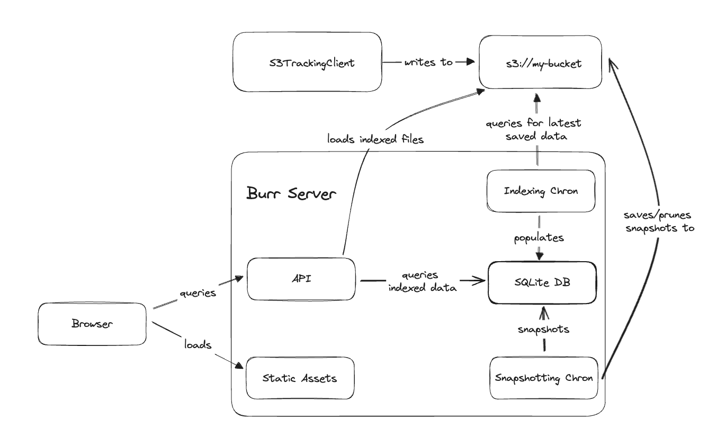

# S3-backed server

This is an implementation of the backend server that uses s3 as the communication buffer.
Rather than being on the blocking path, the client will write to s3, and the server will read up
data/index it.

It is simple -- it only needs a server and an s3 bucket. The rest is handled by the server itself.
Read more in the [architecture](#architecture) section for details/trade-offs.

## Installing

The server is executable by a simple python command (although in production you'll likely want to run it with an actual server).

To get everything you need, you can install as you would any python library:

```bash
pip install "burr[tracking-server-s3, cli]"
```

Note that this enables you to run through the CLI -- you won't need the CLI target to run in production,
but this can help you develop.  You will also need an s3 bucket -- do this through the AWS
(or whatever s3 provider you have) console/API.

See [these instructions](https://docs.aws.amazon.com/AmazonS3/latest/userguide/creating-bucket.html) for how to do so.

This will save data in batched files to s3, which the server will read up and index.

## Running Locally

To test it out after installing/setting up, you can run the server with the following command:

```bash
BURR_S3_BUCKET=my-bucket-name burr --no-open
```

As the normal burr command will, this opens up a browser window to the burr UI, on port 7241.

This will immediately start indexing your s3 bucket (or pick up from the last snapshot, see [architecture](#architecture) for more details).


To track your data, you use the S3TrackingClient. You pass the tracker to the `ApplicationBuilder`:


```python
app = (
    ApplicationBuilder()
    .with_graph(graph)
    .with_identifiers(app_id=app_id)
    .with_tracker(S3TrackingClient(project="project_name", bucket="bucket_name"))
    .with_entrypoint(...)
    .build()
)
```

Note that the data is batched/queued on the client side to avoid a proliferation of files.

The client must have write access to the same bucket the server does. The server must have read/write/list access.

## Architecture

The architecture is built for simplicity and few moving pieces.



It consists of two entities:
1. An S3 bucket
2. A FastAPI server

The FastAPI server contains a few components:
1. Static assets -- served by the FastAPI server (at least in dev mode)
2. A simple FastAPI API
3. A sqlite db to index the data in the s3 bucket
4. Two chron jobs:
   a. Frequent job to check for new data in the s3 bucket
   b. Infrequent job to snapshot the data in the SQLite db

Thus it is consistent after indexing, and can be easily restarted from where it left off.

### Trade-offs

These trade-offs will be addressed in future releases.

#### Advantages

This architecture is ideal for a single-instance deployment and a local instance for debugging, although it happily works for multiple (it
will just duplicate data). The s3 snapshots are shared, so a new deployment can spin up,
but each one will index individually.

As this is a read-only async server, it will scale quite reasonably, and we anticipate single/low-single-digit
instances will handle most use-cases. Furthermore, the server is entirely decoupled from the client, so you can
run the client when the server is down and the data will not be dropped.

#### Limitations

That said, it has the following limitation:

1. Read scale is limited by sqlite (which is quite scalable, but has concurrency limits and size limits relative to node instance storage)
2. The client/server must both be able to read/write to the same s3 bucket
3. The data can be slightly out of date (although this can be tuend by the indexing cadence)
4. This makes multiple `LIST` queries to the s3 bucket, which can be expensive (it it one per project per chron job). Note that each of these only lists the latest (past a certain high watermark).
5. This will often make multiple s3 queries for a single request (one for each file, which is batched to avoid proliferation)


## Configuration

This is configured through environment variables (reach out if you prefer dot-env, this is easy to add as an optional feature).

The following environment variables are used with defaults:

| Name                                 | type                               | Default value |
|--------------------------------------|------------------------------------|---------------|
| BURR_S3_BUCKET                       | str                                | <required>    |
| BURR_UPDATE_INTERVAL_MILLISECONDS    | int                                | 120_000       |
| BURR_AWS_MAX_CONCURRENCY             | int                                | 100           |
| BURR_SNAPSHOT_INTERVAL_MILLISECONDS  | int                                | 3_600_000     |
| BURR_LOAD_SNAPSHOT_ON_START          | bool                               | True          |
| BURR_PRIOR_SNAPSHOTS_TO_KEEP         | int                                | 5             |

To see how these are wired in, see the S3Settings class in [backend.py](backend.py). This leverages
the [pydantic-settings](https://docs.pydantic.dev/latest/concepts/pydantic_settings/) library
to make it easy to configure the server.


## Deployment

Still a WIP -- we have:
1. A docker image (still under construction)
2. A terraform script (still under construction)


## Direction/Future work

We will be addressing the limitations above. Particularly:
1. Add the capability to use a multi-tennant, distributed database (E.G. postgres)
2. Add the ability to listen for events on s3 update and fire immediately, removing the need for `LIST` queries and improving read/write consistency
3. Add the option to have the server handle s3 writing as well as indexing (put it on the blocking path -- this is a trade-off)
4. Add authentication/ACLs to the server
5. Add caching for s3 queries


## Developing

Scratchpad/notes:

To reset, do:
```bash
rm -rf ~/.burr_server &&
mkdir ~/.burr_server &&
rm -rf ./burr/tracking/server/s3/migrations &&
aerich init -t burr.tracking.server.s3.settings.TORTOISE_ORM --location ./burr/tracking/server/s3/migrations  &&
aerich init-db &&
AWS_PROFILE=dagworks burr --no-open
```

Explanation:

- `rm -rf ~/.burr_server` (will be turned to an env variable)
- `mkdir ~/.burr_server` (ditto)
- (from git root) `rm -rf ./burr/tracking/server/s3/migrations`
- (from git root) `aerich init -t burr.tracking.server.s3.settings.TORTOISE_ORM  --location ./burr/tracking/server/s3/migrations`
- (from git root) `aerich init-db`
