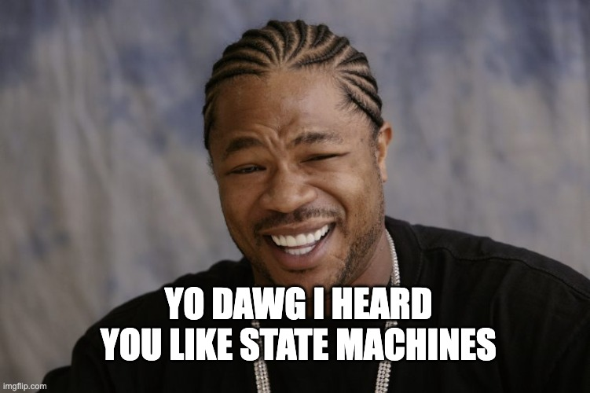

======================
Recursive Applications
======================

Burr supports sub-applications. E.G. running Burr within Burr.
Currently this capability is only done with tracking (linking applications),
but we are actively working on building first-level constructs that allow this.

This can enable the following use-cases (among many others):

1. Parallel results to different LLMs for comparison
2. Multi simultaneous tasks/chains for an LLM
3. Black-boxing an action as a subset of tasks
4. Running multiple queries simultaneously and getting an LLM to synthesize.

And so on. These can be arbitrarily complex and nested, allowing agents consisting of agents consisting of agents...

You can find an example `here <https://github.com/dagworks-inc/burr/tree/main/examples/recursive>`_.

--------
Tracking
--------

Currently, to leverage nested Burr apps, you do the following:

1. Create a parent app (as you normally would)
2. Leverage tracking
3. Create an action inside that
4. Run your Burr sub-application inside that action
5. Wire through tracker + parent data for the sub-application

After creating a simple application (1)/(2) above, you can wire through the tracker like this (some pseudocode, see the example for a fully working application).

.. code-block:: python

    @action(reads=["parameters_to_map"], writes=["joined_results"])
    def run_multiple_sub_apps(state: State, __context: ApplicationContext) -> State:
        # for every parameter incoming, run a sub-application
        results = []
        for parameter_set in state["parameters_to_map"]:
            subapp = (
                ApplicationBuilder()
                .with_actions(...)
                .with_transitions(...)
                .with_tracker(__context.tracker.copy())
                .with_spawning_parent(
                    __context.app_id,
                    __context.sequence_id,
                    __context.partition_key,
                )
                .with_entrypoint(...)
                .with_state(...)
                .build()
            )
            results.append(subapp.run(...))

        joined = _join(results)

        return state.update(joined_results= _join(results))

Note we're simply passing through the tracker to the next app, which sets a link between them.
The tracker knows how to record the link so its in the UI.

You can also run this in parallel -- this leverages `joblib <https://joblib.readthedocs.io/en/latest/>`_'s
Parallel and delayed functions, but you can use whatever tooling you want (multiprocessing, threading, etc...).

.. code-block:: python

    @action(reads=["parameters_to_map"], writes=["joined_results"])
    def run_multiple_sub_apps(state: State, __context: ApplicationContext) -> State:
        def run_subapp(parameter_set):
            subapp = (
                ApplicationBuilder()
                .with_actions(...)
                .with_transitions(...)
                .with_tracker(__context.tracker.copy())
                .with_spawning_parent(
                    __context.app_id,
                    __context.sequence_id,
                    __context.partition_key,
                )
                .with_entrypoint(...)
                .with_state(...)
                .build()
            )
            return subapp.run(...)

        results = Parallel(n_jobs=-1)(delayed(run_subapp)(parameter_set) for parameter_set in state["parameters_to_map"])
        joined = _join(results)

        return state.update(joined_results=joined)

Note the following:

1. You don't have to pass in partition_key, but you need to pass in the app_id and sequence_id so the app can track
2. You currently need to run ``__context.tracker.copy()`` to ensure the tracker is passed through correctly. We will likely be relaxing this, but it could corrupt the tracking state if you forget.
3. You may want to have more control over the application ID's -- you may want to use a stable hash of the parameters and the parent App ID

For persistence, you'll want to use (3) to ensure a stable hash -- have the sub-application load its own state from the ID, resuming where it left off.

When you track in the UI, you will see the following (in this example we're generating poems of different styles in parallel):

-------------------
Future Improvements
-------------------

We are working on the following:

1. A recursive application to allow for more ergonomic management of the above
2. Static visualization of the recursive application when using (1)
3. A more ergonomic way to pass through the tracker

Stay tuned!
