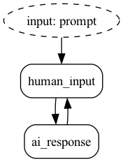

.. _simpleexample:

==============
Simple Example
==============

Let's build a basic chatbot using Burr.

While Burr has a host of features related to state management and inspection, this basic tutorial is going to demonstrate two that are particularly relevant to LLM apps.

1. Specifying user inputs
2. Persisting state across multiple interactions

This tutorial will set you up to do more complex things, including:

1. Building an application that makes decisions/handles conditional edges
2. Persisting state in a database
3. Tracking/monitoring your application
4. Generating test cases from prior application runs

So hold tight! This gets you started with the basics but there's a lot more you can do with little effort.

.. note::

    This should take about 10 minutes to complete, and give you a good sense of the library basics.
    You'll need an OpenAI key set as the environment variable ``OPENAI_API_KEY``. If you don't have one you can get one at `OpenAI <https://platform.openai.com>`_.
    If you don't want to get one, check out the simple example of a `counter application <https://github.com/DAGWorks-Inc/burr/tree/main/examples/hello-world-counter>`_.

    If you want to skip ahead to the cool stuff (chatbots, ML training, simulations, etc...) feel free to jump into the deep end and start with the :ref:`examples <examples>`.

🤔 If you prefer to learn by video, check out
`this video walkthrough <https://www.youtube.com/watch?v=rEZ4oDN0GdU>`_
using `this notebook <https://github.com/DAGWorks-Inc/burr/blob/main/examples/simple-chatbot-intro/notebook.ipynb>`_.

----------------------
Build a Simple Chatbot
----------------------

Let's build! Our chatbot will accept user input and pass it to an AI. The AI will then respond with a message.

Let's start by defining some actions, the building-blocks of Burr. You can think of actions as a function that
computes a result and modifies state. They declare what they read and write.

We define two actions:

1. ``human_input`` This accepts a prompt from the outside and adds it to the state
2. ``ai_response`` This takes the prompt + chat history and queries OpenAI.

.. code-block:: python

    client = openai.Client()

    @action(reads=[], writes=["prompt", "chat_history"])
    def human_input(state: State, prompt: str) -> State:
        chat_item = {
            "content": prompt,
            "role": "user"
        }
        return state.update(prompt=prompt).append(chat_history=chat_item)

    @action(reads=["chat_history"], writes=["response", "chat_history"])
    def ai_response(state: State) -> State:
        content = client.chat.completions.create(
            model="gpt-3.5-turbo",
            messages=state["chat_history"],
        ).choices[0].message.content
        chat_item = {
            "content": content,
            "role": "assistant"
        }
        return state.update(response=content).append(chat_history=chat_item)

Before we proceed, let's note the following about how we define these actions:

1. State is a dictionary -- actions declare input fields (as strings) and write values to those fields
2. Actions use a specific *immutable* state object and call operations on it (``.append(...)``, ``.update(...)``)
3. Functions can do whatever you want -- they can use plain python, or delegate to `langchain <langchain.io>`_, `hamilton <https://github.com/dagworks-inc/hamilton>`_, etc... All they have to do is return the new state.
4. We declare the parameter ``prompt``, meaning that we will expect the user to pass ``prompt`` every time they run the graph.

.. note::

   The action API has a few different forms. We've shown the simplest above, but it can also return a tuple of ``result, state`` (where ``result``
   the intermediate result of the computation), to help with debugging. There are also multiple class-based APIs. See the :ref:`actions <actions>` section for more details.

Next, let's piece together our application. To do this, we'll use an ``ApplicationBuilder``

.. code-block:: python

    app = (
        ApplicationBuilder()
        .with_actions(human_input, ai_response)
        .with_transitions(
            ("human_input", "ai_response"),
            ("ai_response", "human_input")
        ).with_state(chat_history=[])
        .with_entrypoint("human_input")
        .build()
    )

We can visualize the application (note you need ``burr[graphviz]`` installed):

.. code-block:: python

    app.visualize("./graph", format="png")

Let's note the following about how we define the application:

1. It is an infinite loop! It is meant to pause for new prompt input.
2. We're just using the function names as the action names. You can also name them if you want ``with_actions(human_input=human_input, ai_response=ai_response)``.
3. We start it with an empty ``chat_history`` state field
4. It utilizes a `builder pattern <https://en.wikipedia.org/wiki/Builder_pattern#:~:text=The%20builder%20pattern%20is%20a,Gang%20of%20Four%20design%20patterns>`_ -- this is a bit old-school (comes from the java days), but is an easy/modular way to express your application

Finally, we can run the application -- it gives back multiple pieces of information but all we'll use is the state.

.. code-block:: python

    *_, state = app.run(halt_after=["ai_response"], inputs={"prompt": "Who was Aaron Burr?"})
    print("answer:", app.state["response"])
    print(len(state["chat_history"]), "items in chat")

The result looks exactly as you'd expect!

.. code-block:: text

    answer: Aaron Burr was an American politician and lawyer who served as the third
    Vice President of the United States from 1801 to 1805 under President Thomas Jefferson.
    He is also known for killing Alexander Hamilton in a famous duel in 1804.
    Burr was involved in various political intrigues and controversies throughout his career,
    and his reputation was tarnished by suspicions of treason and conspiracy.
    2 items in chat

If you want to copy/paste, you can open up the following code block and add to a file called ``run.py``:

.. collapse:: <code>run.py</code>

    .. code-block:: python

        import uuid

        import openai

        from burr.core import action, State, ApplicationBuilder

        client = openai.Client()

        @action(reads=[], writes=["prompt", "chat_history"])
        def human_input(state: State, prompt: str) -> State:
            chat_item = {
                "content": prompt,
                "role": "user"
            }
            return state.update(prompt=prompt).append(chat_history=chat_item)

        @action(reads=["chat_history"], writes=["response", "chat_history"])
        def ai_response(state: State) -> State:
            content = client.chat.completions.create(
                model="gpt-3.5-turbo",
                messages=state["chat_history"],
            ).choices[0].message.content
            chat_item = {
                "content": content,
                "role": "assistant"
            }
            return state.update(response=content).append(chat_history=chat_item)
        app = (
            ApplicationBuilder()
            .with_actions(human_input, ai_response)
            .with_transitions(
                ("human_input", "ai_response"),
                ("ai_response", "human_input")
            ).with_state(chat_history=[])
            .with_entrypoint("human_input")
            .build()
        )

        app.visualize("./graph", format="png")
        *_, state = app.run(halt_after=["ai_response"], inputs={"prompt": "Who was Aaron Burr?"})
        print("answer:", app.state["response"])
        print(len(state["chat_history"]), "items in chat")

Finally, let's open up the UI and see what it looks like (note, that if you have not installed ``burr[learn]`` now is a good time...).

.. code-block:: bash

    burr

You'll see the UI pop up with projects. Navigate to `the UI <http://localhost:7241/project/my_first_app>`_ and explore!

Now that we've built a basic application, we can do the following with only a few lines of code:

1. :ref:`Add conditional edges <transitions>` --  add a condition as a third item in the tuple to the ``with_transitions`` method.
2. :ref:`Persist state to a database + reload <state-persistence>` -- add a ``initialize_from`` line to the builder and select a pre-existing/implement a custom persistence method.
3. :ref:`Add monitoring to track application data <tracking>` -- leverage ``with_tracker`` to track to the Burr UI and visualize your application live.
4. :ref:`Stream results back <streaming>` -- minimize time to first token by streaming results back to the user.
5. `Generate test cases from prior runs <https://github.com/DAGWorks-Inc/burr/tree/main/examples/test-case-creation>`_ -- use the ``burr-testburr-test-case create`` command to automatically generate test cases for your LLM app.
