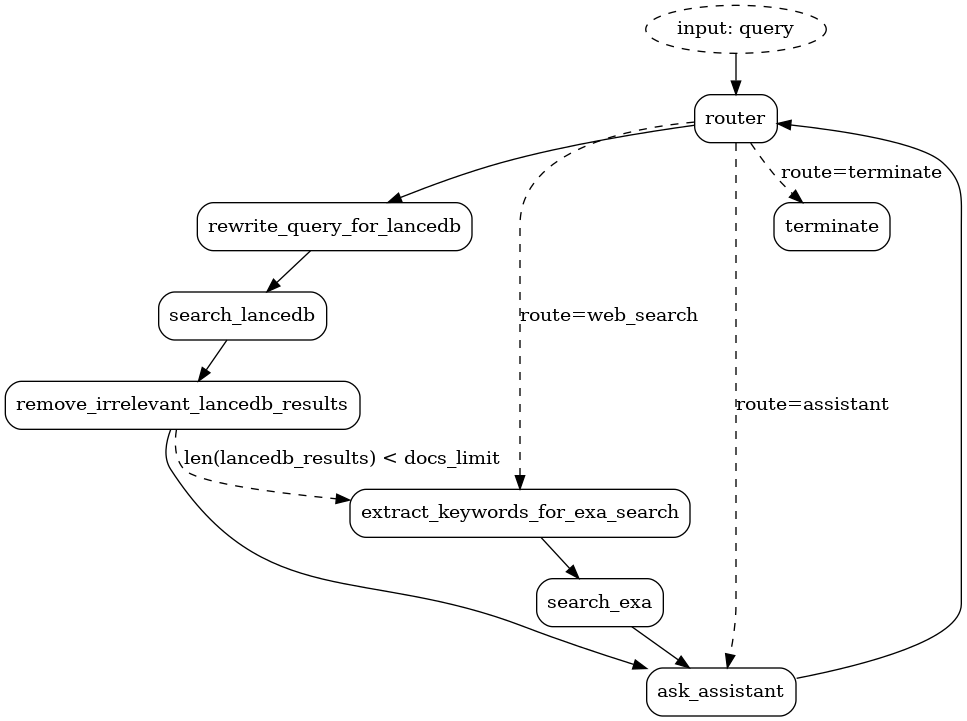

#### [Adaptive-RAG](https://arxiv.org/pdf/2403.14403) is a strategy for dynamically selecting the most suitable route for a given user query. A route could be vector database retrieval, web search, direct answer, or any other viable route.

#### [Corrective-RAG (CRAG)](https://arxiv.org/pdf/2401.15884) is a strategy for RAG that incorporates self-reflection / self-grading on retrieved documents.

So if we combine the two, we get a system that can dynamically select the most suitable route for a given user query and then self-reflect on the retrieved documents to improve the quality of the response. This is a powerful combination that can lead to more accurate and relevant responses to user queries.

We will use [LanceDB](https://lancedb.github.io/lancedb/) as our vector database and [Exa](https://exa.ai/) as our web search engine.

The possible routes that are guaranteed using `Instructor`:
1. names of all available `LanceDB` tables.
2. web_search
3. assistant
4. terminate (if the `query` is in ["exit", "quit", "q"])

So the `transitions` check for routes 2-4 and we assume that it must be _one_ of the tables otherwise.
`ask_assistant` will combine all `lancedb_results` and `exa_search_results` for context if they exist in the `state`, and then reset them to `[]`
We stop after `ask_assistant` to get the next `query` for `router`.

## Adaptive-CRAG 🧪

We have some of the core concepts from the [Burr Docs](https://burr.dagworks.io/concepts/) in a folder and we will add that to a `LanceDB` table for Hybrid Search. You can add as many tables as you want. Each table will be a different route for the `router`.