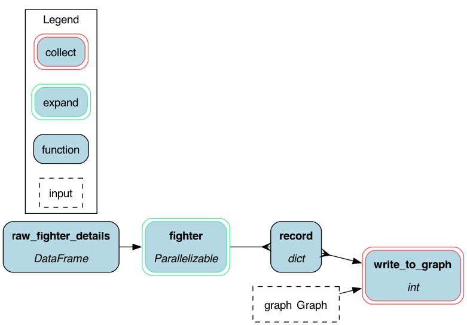
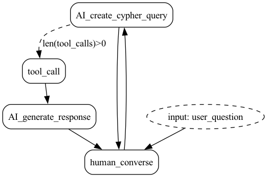

# Conversational agent over UFC Knowledge graph

## Introduction
This demo illustrates how to build a RAG Q&A AI agent over the [UFC stats dataset](https://www.kaggle.com/datasets/rajeevw/ufcdata)
This one uses a Knowledge Graph that is stored in [FalkorDB](https://www.falkordb.com/) to query
for information about UFC fighters and fights.

Thanks to the folks at [FalkorDB](https://www.falkordb.com/) for helping set up this example.

## Data
The [UFC](http://ufc.com) publicly offers statistics for each fight it held in addition to individual fighter's
personal statistics on [UFC stats](http://ufcstats.com/statistics/events/completed)

This information includes among other details:
* Where and when an event was held
* Details and statistics of a fight
* Who won a fight
* How long a fight lasted
* Fighter's reach

We have pulled some data and stored it in the `/data` folder.


# Querying the AI agent
Once the data is loaded either into a Knowledge Graph, users can start asking the AI agent questions. For example:

```
Which fighter holds the fastest win?

The fighter who holds the fastest win is Jorge Masvidal, with a win in just 5 second

Who did he win against ?

Jorge Masvidal won against Ben Askren in the fight where he secured the fastest win.

List fighters who had a trilogy match

The only fighters specifically identified in the data having a trilogy (i.e., three matches against the same opponent) are:

- Frankie Edgar and BJ Penn
- Randy Couture and Vitor Belfort
- BJ Penn and Frankie Edgar
- Cain Velasquez and Junior Dos Santos
...

Who has a 50% win percentage?

Yes, there are fighters with a 50% win percentage in the dataset. Here are a few of them:

- Joe Slick: 1 win out of 2 fights (50%)
- Ken Stone: 2 wins out of 4 fights (50%)
- Tim Boetsch: 12 wins out of 24 fights (50%)
- Jordan Wright: 1 win out of 2 fights (50%)
- Travis Fulton: 1 win out of 2 fights (50%)

```

# Running the demo

## Prerequisites

Install Python modules
```sh
pip install -r requirements.txt
```

Run FalkorDB
```sh
docker run -p 6379:6379 -p 3000:3000 -it --rm falkordb/falkordb:edge
```
Note: at the time of writing this image did not persist data.

## Ingest data
We first need to create the Knowledge Graph.

**Ingest data using the command line**:

```sh
python hamilton_ingest.py
```
This will run the following two pipelines:




**Note:** [Hamilton](https://github.com/dagworks-inc/hamilton) also comes with a UI that you can use to visualize the pipeline and
track execution information about it. See hamilton_ingest.py or ingest_notebook.ipynb for more information.

## Ingest data using a notebook:

```sh
pip install jupyter
jupyter notebook
# select ingest_notebook.ipynb and follow the instructions there
```

## Run the QA agent via the notebook:
```sh
export OPENAI_API_KEY="YOUR_OPENAI_KEY"
pip install jupyter
jupyter notebook
# select notebook.ipynb and follow the instructions there
```

## Run the QA agent via the command line:
```sh
export OPENAI_API_KEY="YOUR_OPENAI_KEY"
python application.py
```

Knowledge Graph generated:


Application Graph generated:


## See the trace of the QA agent with the Burr UI
In a terminal run:
```sh
burr
```
Then open a browser and go to `http://localhost:7241` to see the Burr UI.

You can then navigate to the `ufc-falkor` project and see the trace of the QA agent.
