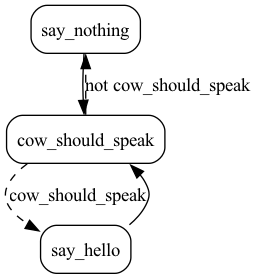

# Cowsay

This is an example of a simple infinite state machine.

We have three files:

- [application.py](application.py) -- This contains a mainline to run the cowsay app as well as a function to export the app (for later use)
- [requirements.txt](requirements.txt) -- Just the requirements. All this needs is Burr/Streamlit/cowsay
- [streamlit_app.py](streamlit_app.py) -- This contains a simple Streamlit app to interact with the cow

To run just the application, you can run:

```bash
python application.py
```

Note this is an infinte state machine, so this will run forever! Thus remember to ctrl-c eventually.
To run the streamlit app, you can run:

```bash
streamlit run streamlit_app.py
```

This allows you to press a button and see the cow say something (or see it decide not to speak).

This will open a chrome window and print out the URL. The state machine this encapsulates takes the following form:


