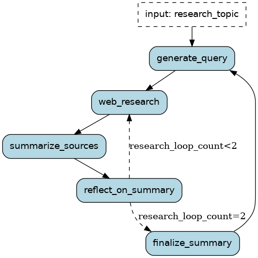

# Deep Researcher

## Introduction

The structure of the research assistant is taken from a [langchain and langgraph example](https://github.com/langchain-ai/local-deep-researcher). It is rewritten here in the Burr framework in `application.py`.



The helper code in `prompts.py` and `utils.py` is directly taken from the original deep researcher codebase. The MIT license for the code is included in both those files.

## Prerequisites

Set the configuration variables at the beginning of the main section of `application.py`.

Then install Python modules
```sh
pip install -r requirements.txt
```

You will need accounts for [Tavily search](https://tavily.com/) and the [OpenAI API](https://platform.openai.com/docs/overview). Once you have those accounts, set the environment variables TAVILY_API_KEY and OPENAI_API_KEY and run the script.

```sh
export OPENAI_API_KEY="YOUR_OPENAI_KEY"
export TAVILY_API_KEY="YOUR_TAVILY_API_KEY"
python application.py
```
