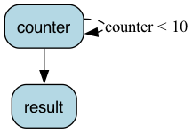

# Counter

This is an example of a simple state machine.

We have three files:

- [application.py](application.py) -- This contains a mainline to run the counter as well as a function to export the counter (for later use)
- [requirements.txt](requirements.txt) -- Just the requirements. All this needs is Burr/Streamlit
- [streamlit_app.py](streamlit_app.py) -- This contains a simple Streamlit app to interact with the counter.
- [notebook.ipynb](notebook.ipynb) -- A notebook that shows the counter app too. Open the notebook <a target="_blank" href="https://colab.research.google.com/github/dagworks-inc/burr/blob/main/examples/hello-world-counter/notebook.ipynb">
  
</a>

To run just the application, you can run:

```bash
python application.py
```

To run the streamlit app, you can run:

```bash
streamlit run streamlit_app.py
```

This will open a chrome window and print out the URL. The state machine this encapsulates takes the following form:


