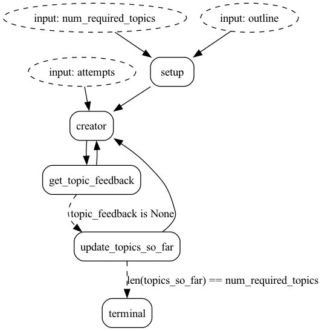

# Structured Outputs with Instructor

We will show how to use [Instructor](https://python.useinstructor.com/) with [Gemini Flash](https://deepmind.google/technologies/gemini/flash/) to get structured outputs with a human in the loop.

Suppose you have an outline for a course you're teaching and you want to break it down into n topics with this structure:

    Topic 1
    |__ Subtopic 1
        |__ Concept 1
        |__ Concept 2
        |   ...
    |__ Subtopic 2
        |__ Concept 1
        |__ Concept 2
        |__ Concept 3
        |   ...
    |   ...
    Topic 2
    |__ Subtopic 1
        |__ Concept 1
        |   ...
    |   ...
    .
    .
    .
    Topic n
    |__ Subtopic 1
        |__ Concept 1
        |   ...
    |   ...

Instructor allows us to set `Topic` as the return type of our LLM call. So we can guarantee that the output will be a `Topic` object, and not just a string.

## Burr

We _could_ just run a loop to generate a new topic `n` times, but what if we're not happy with topic `2/n`? What if the model comes up with a naming convention that we don't like and our prompt wasn't that specific in the first place? What if we just want to add some sutble changes to the latest generated topic?

We just wasted all those tokens, minutes, dollars.

That's where **Burr** comes in. By having the `creator` function as a node, we will ask the user for feedback on the generated topic. If the user is happy with the topic, we will move on to the next one. If not, we will use the feedback to generate the topic again. We will keep doing this until we've reached `n` topics that the user is happy with.



## How to run

To run this example, you need to install the following dependencies:

```bash
pip install -r requirements.txt
```

Then if you run `jupyter lab` you can open/execute the notebook.
This simulates an interactive web app. The notebook is the best way to get started.
