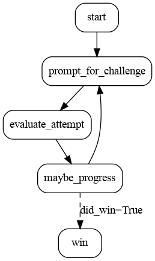

A simple text-based game in the style of 80s adventure games, in which you play
a hungry corgi.

How to run:

```
OPENAI_API_KEY=<your key> python application.py
```

Open the notebook <a target="_blank" href="https://colab.research.google.com/github/dagworks-inc/burr/blob/main/examples/llm-adventure-game/notebook.ipynb">
  
</a>


