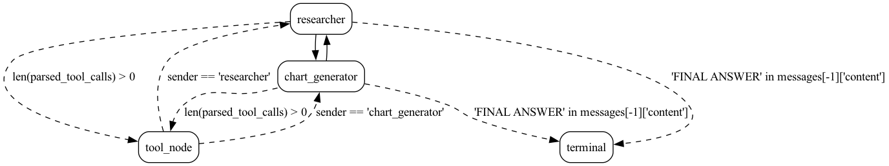
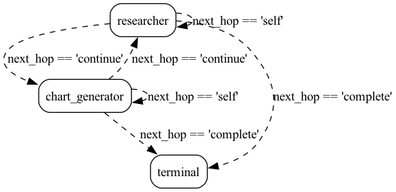

# Multi Agent Collaboration

This example resembles the example from following [cookbook](https://github.com/langchain-ai/langgraph/blob/main/examples/multi_agent/multi-agent-collaboration.ipynb).

There are three implementations:

1. `hamilton_application.py` -- this uses [Hamilton](https://github.com/dagworks-inc/hamilton) inside the actions.
2. `lcel_application.py` -- this uses LangChain's LCEL inside the actions.
3. `application.py` -- this simplifies the graph to have tool calling happen inside the actions.

# `hamilton_application.py` vs `lecl_application.py`:

- They should be functionally equivalent, except that langchain uses deprecated
openai tool constructs underneath, while Hamilton uses the non-deprecated function calling
constructs.
- Compare the two examples to see the code. Burr however doesn't change.

## show me the prompts
With Hamilton the prompts can be found in `func_agent.py`.

With LangChain that's difficult. You'll need to dive into their code to see what ends up being sent.

# Tracing
You'll see that both `hamilton_application.py` and `lecl_application.py`
have some lightweight `tracing` set up. This is a simple way to plug into Burr's
tracer functionality -- this will allow you to see more in the Burr UI.

More functionality is on the roadmap!

# Running the example

Install the dependencies:

```bash
pip install "burr[start]" -r requirements.txt
```

Make sure you have the API Keys in your environment:

```bash
export OPENAI_API_KEY=YOUR_KEY
export TAVILY_API_KEY=YOUR_KEY
```


To run the example, you can do:

```bash
python hamilton_application.py
```
Application run:


or
```bash
python lcel_application.py
```
Application run:


or
```bash
python application.py
```
Application run:

