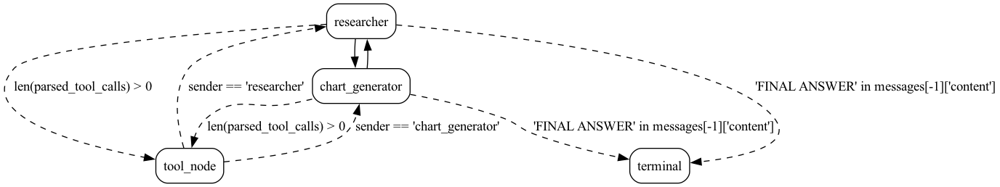

# Multi Agent Collaboration

This example resembles the example found originally [here](https://github.com/langchain-ai/langgraph/blob/main/examples/multi_agent/multi-agent-collaboration.ipynb).


## show me the prompts
With Hamilton the prompts can be found in the moduel [`func_agent.py`](func_agent.py).

# Tracing
You'll see that in `application.py` we
have some lightweight `tracing` set up for Hamilton. This is a simple way to plug into Burr's
tracer functionality -- this will allow you to see more in the Burr UI.

More functionality is on the roadmap!

# Running the example
Install the dependencies:

```bash
pip install "burr[start]" -r requirements.txt
```

Make sure you have the API Keys in your environment:

```bash
export OPENAI_API_KEY=YOUR_KEY
export TAVILY_API_KEY=YOUR_KEY
```

Run the notebook:
<a target="_blank" href="https://colab.research.google.com/github/dagworks-inc/burr/blob/main/examples/multi-agent-collaboration/hamilton/notebook.ipynb">
  
</a>
or do it manually:
```bash
jupyter notebook
```
and open the notebook `notebook.ipynb`.

```bash
python application.py
```
Application run:


# What to adjust
There are a few things:

1. The `query` that you provide for the agents to work over. This is just a matter of setting the `query` variable in
the initial state passed in to the application.
2. You can adjust the `prompts` used in the actual function calls in `func_agent.py`.
