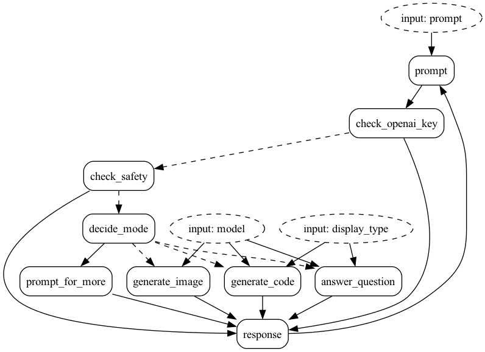

# GPT-like chatbot

This is an example of chatgpt-like bot. It is simplified, but demonstrates the core concepts nicely.

The core idea is that we:

1. Accept a prompt
2. Check to see if the prompt is "safe" (this is currently a no-op, but its there for show)
3. Decide the response mode by querying openAI (answer a question, generate an image, write some code, and can't decide/prompt for more)
4. Query one of our models with a modified prompt to return the right response
5. Return the response
6. Go back to the beginning and wipe the state.

We have both a hamilton and non-hamilton implementation of this for comparison. For the simplicity of this example,
Hamilton is likely overkill. There are a few nodes that could leverage it well, but the rest are too simple to
worry about putting in a DAG. As examples get more complex, we anticipate that Hamilton nodes will play a more important role.

The state machine this encapsulates takes the following form:



Note that it is currently wired up to handle errors in the state machine, but the actions do not respect that yet. Coming soon.

We have three files:

- [application.py](application.py) -- This contains a mainline to generate the graph portrayal.
- [requirements.txt](requirements.txt) -- Just the requirements. All this needs is Burr/Streamlit/openai
- [simple_streamlit_app.py](simple_streamlit_app.py) -- This contains a more sophisticated Streamlit app to interact with.
- [streamlit_app.py](streamlit_app.py) -- This contains a simple Streamlit app to interact with that is more
sophisticated than the simple version. It contains a more sophisticated UI that also visualizes the Burr application.
You must have your `OPENAI_API_KEY` set in your environment. You can do this by running.

```bash
streamlit run simple_streamlit_app.py & burr
```

This will open up both a streamlit app and a server at the same time. Interact with the app, and see
interactions in the Burr UI.


Alternatively, run the more sophisticated streamlit app:

```bash
streamlit run streamlit_app.py
```

This streamlit app renders the statemachine as well as exposing the burr application showing you
can build a more sophisticated UI around the Burr application.


## Tracing
To see a tracing example see this [example](../tracing-and-spans).
