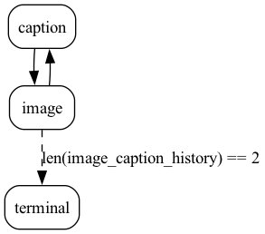

# Image Telephone

This example demonstrates how to play telephone with DALL-E and ChatGPT.

You provide an initial image to ChatGPT, which then generates a caption. The caption
is saved to state. That caption is then provided to DALL-E, which generates an image, which is saved to state.
You then provide that image to ChatGPT, and so on.

Right now the teriminal state is set to 2, so the game will end after 2 iterations:

## Modifying the game
There are two levels you can modify:

1. The high-level orchestration and state management
2. What each action actually does.

For the high-level orchestration you can add more nodes, change conditions, etc.

For the low-level actions, you can change the prompt, the template, etc. too. To do so see the
documentation for the Hamilton dataflows that are used: [captioning](https://hub.dagworks.io/docs/Users/elijahbenizzy/caption_images/) and
[generating image](https://hub.dagworks.io/docs/Users/elijahbenizzy/generate_images/). You can easily modify the prompt and
template by overriding values, or by copying the code and modifying it yourself in 2 minutes - see instructions on the [hub](https://hub.dagworks.io/).
