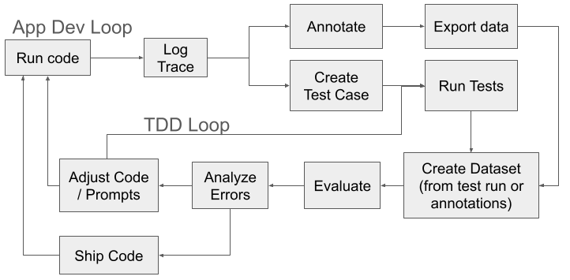

# A SDLC with Burr and pytest
Here we show a quick example of a software development lifecycle (SDLC) with Burr and pytest.



While we don't cover everything in the diagram, in this example we specifically show how to do most of the TDD loop:

1. Create a test case.
2. Run the test case.
3. Create a dataset.
4. Show how you might construct evaluation logic to evaluate the output of your agent / augmented LLM / application.

using Burr and pytest.

# Using pytest to evaluate your agent  / augmented LLM / application

An agent / augmented LLM is a combination of LLM calls and logic. But how do we know if it's working? Well we can test & evaluate it.

From a high level we want to test & evaluate the "micro" i.e. the LLM calls & individual bits of logic,
through to the "macro" i.e. the agent as a whole.

But, the challenge with LLM calls is that you might want to "assert" on various aspects of the
output without failing on the first assertion failure, which is standard test framework behavior. So what are you to do?

Well we can use some `pytest` constructs to help us with this.

## pytest Constructs
To start let's recap pytest quickly, then move on to how we can evaluate multiple aspects without failing on the first assertion failure.

### pytest basics
We like pytest because we think it's simpler than the unittest module python comes with. To use it you need to install it first:

```bash
pip install pytest
```

Then to define a test it's just a function that starts with `test_`:

```python
# test_my_agent.py

def test_my_agent():
    assert my_agent("input1") == "output1"
    assert my_agent("input2") == "output2"
    # can have multiple asserts here - it'll fail on the first one and not run the rest
```
Yep - no classes to deal with. Just a function that starts with `test_`. Then to run it:

```bash
pytest test_my_agent.py
```
Boom, you're testing!

### Parameterizing Tests
We can also parameterize tests to run the same test with different inputs. This comes in handy as we build up
data points to evaluate our agent or parts of our agent. Each input is then an individual test that can error. Here's an example:

```python
import pytest

@pytest.mark.parametrize(
    "input, expected_output",
    [
        ("input1", "output1"),
        ("input2", "output2"),
    ],
    ids=["test1", "test2"] # these are the test names for the above inputs
)
def test_my_agent(input, expected_output):
    actual_output = my_agent(input) # your code to call your agent or part of it here
    # can include static measures / evaluations here
    assert actual_output == expected_output
    # assert some other property of the output...
```
What we've shown above will fail on the first assertion failure. But what if we want to evaluate all the outputs before making a pass / fail decision?

### What kind of "asserts" do we want?

We might want to evaluate the output in a number of ways:
1. Exact match - the output is exactly as expected.
2. Fuzzy match - the output is close to what we expect, e.g. does it contain the right words, is it "close" to the answer, etc.
3. Human grade - the output is graded by a human as to how close it is to the expected output.
4. LLM grade - the output is graded by an LLM as to how close it is to the expected output.
4. Static measures - the output has some static measures that we want to evaluate, e.g. length, etc.

It is rare that you solely rely on (1) with LLMs, and you'll likely want to evaluate the output in a number of ways before making a pass / fail decision.
E.g. that the output is close to the expected output, that it contains the right words, etc., and then make a pass / fail decision based on all these evaluations.

### Not failing on first assert failure / logging test results

One limitation of pytest is that it fails on the first assertion failure. This is not ideal if you want to evaluate multiple aspects of the output before making a pass / fail decision.

There are multiple ways one could solve this limitation, as pytest is very extensible. We will only go over one way here,
which is to use the `pytest-harvest` plugin to log what our tests are doing. This allows us to capture the results of our tests in a structured way without
breaking at the first asserting failure. This means we can mix and match where appropriate hard "assertions" - i.e. definitely fail, with
softer ones where we want to evaluate all aspects before making an overall pass / fail decision. We walk through how to do this below using a few
pytest constructs.

`results_bag` is a fixture that we can log values to from our tests. This is useful if we don't want to fail on the first assert statement,
and instead capture a lot more. This is not native to pytest, and is why we use the `pytest-harvest` plugin to achieve this.

To use it, you just need to install `pytest-harvest` and then you can use the `results_bag` fixture in your tests:

```python
def test_my_agent(results_bag):
    results_bag.input = "my_value"
    results_bag.output = "my_output"
    results_bag.expected_output = "my_expected_output"
```

We can then access the results in the `results_bag` from the `pytest-harvest` plugin via the `module_results_df` fixture that
provides a pandas dataframe of the results:

```python
def test_print_results(module_results_df):
    # place this function at the end of the module so that way it's run last.
    print(module_results_df.columns) # this will include "input", "output", "expected_output"
    print(module_results_df.head()) # this will show the first few rows of the results
    # TODO: Add more evaluation logic here or log the results to a file, etc.
    # assert some threshold of success, etc.
```
This enables us to get a dataframe of all the results from our tests, and then we can evaluate them as we see fit for our use case.
E.g. we only pass tests if all the outputs are as expected, or we pass if 80% of the outputs are as expected, etc. You could
also log this to a file, or a database, etc. for further inspection and record keeping, or combining it with
open source frameworks [mlflow](https://mlflow.org) and using their [evaluate functionality](https://mlflow.org/docs/latest/llms/llm-evaluate/index.html).

Note: we can also combine `results_bag` with ``pytest.mark.parametrize`` to run the same test with different inputs and expected outputs:

```python
import pytest

@pytest.mark.parametrize(
    "input, expected_output",
    [
        ("input1", "output1"),
        ("input2", "output2"),
    ],
    ids=["test1", "test2"] # these are the test names for the above inputs
)
def test_my_agent(input, expected_output, results_bag):
    results_bag.input = input
    results_bag.expected_output = expected_output
    results_bag.output = my_agent(input) # your code to call the agent here
    # can include static measures / evaluations here
    results_bag.success = results_bag.output == results_bag.expected_output
```


### Using Burr's pytest Hook
With Burr you can curate test cases from real application runs. You can then use these test cases in your pytest suite.
Burr has a hook that enables you to curate a file with the input state and expected output state for an entire run,
or a single action.  See the [Burr test case creation documentation](https://burr.dagworks.io/examples/guardrails/creating_tests/) for more
details on how. Here we show you how you can combine this with getting results:

```python
import pytest
from our_agent_application import prompt_for_more

from burr.core import state

# the following is required to run file based tests
from burr.testing import pytest_generate_tests  # noqa: F401

@pytest.mark.file_name("prompt_for_more.json") # our fixture file with the expected inputs and outputs
def test_an_agent_action(input_state, expected_state, results_bag):
    """Function for testing an individual action of our agent."""
    input_state = state.State.deserialize(input_state)
    expected_state = state.State.deserialize(expected_state)
    _, output_state = prompt_for_more(input_state)  # exercising an action of our agent

    results_bag.input_state = input_state
    results_bag.expected_state = expected_state
    results_bag.output_state = output_state
    results_bag.foo = "bar"
    # TODO: choose appropriate way to evaluate the output
    # e.g. exact match, fuzzy match, LLM grade, etc.
    # this is exact match here on all values in state
    exact_match = output_state == expected_state
    # for output that varies, you can do something like this
    # assert 'some value' in output_state["response"]["content"]
    # or, have an LLM Grade things -- you need to create the llm_evaluator function:
    # assert llm_evaluator("are these two equivalent responses. Respond with Y for yes, N for no",
    # output_state["response"]["content"], expected_state["response"]["content"]) == "Y"
    # store it in the results bag
    results_bag.correct = exact_match

    # place any asserts at the end of the test
    assert exact_match
```
So if we want to test an entire agent, we can use the same approach, but instead rely on the input and output
state being the entire state of the agent at the start and end of the run.

```python
import pytest
from our_agent_application import agent_builder, agent_runner # some functions that build and run our agent

from burr.core import state

# the following is required to run file based tests
from burr.testing import pytest_generate_tests  # noqa: F401

@pytest.mark.file_name("e2e.json") # our fixture file with the expected inputs and outputs
def test_an_agent_e2e(input_state, expected_state, results_bag):
    """Function for testing an agent end-to-end."""
    input_state = state.State.deserialize(input_state)
    expected_state = state.State.deserialize(expected_state)
    # exercise the agent
    agent = agent_builder(input_state) # e.g. something like some_actions._build_application(...)
    output_state = agent_runner(agent)

    results_bag.input_state = input_state
    results_bag.expected_state = expected_state
    results_bag.output_state = output_state
    results_bag.foo = "bar"
    # TODO: choose appropriate way to evaluate the output
    # e.g. exact match, fuzzy match, LLM grade, etc.
    # this is exact match here on all values in state
    exact_match = output_state == expected_state
    # for output that varies, you can do something like this
    # assert 'some value' in output_state["response"]["content"]
    # or, have an LLM Grade things -- you need to create the llm_evaluator function:
    # assert llm_evaluator("are these two equivalent responses. Respond with Y for yes, N for no",
    # output_state["response"]["content"], expected_state["response"]["content"]) == "Y"
    # store it in the results bag
    results_bag.correct = exact_match

    # place any asserts at the end of the test
    assert exact_match

```
#### Using the Burr UI to observe test runs
You can also use the Burr UI to observe the test runs. This can be useful to see the results of the tests in a more visual way.
To do this, you'd instantiate the Burr Tracker and then run the tests as normal. A notes on ergonomics:

1. It's useful to use the test_name as the partition_key to easily find test runs in the Burr UI. You can also make the app_id match some test run ID, e.g. date-time, etc.
2. You can turn on opentelemetry tracing to see the traces in the Burr UI as well.
3. In general this means that you should have a parameterizeable application builder function that can take in a tracker and partition key.

```python
import pytest
from our_agent_application import agent_builder, agent_runner # some functions that build and run our agent

from burr.core import state

# the following is required to run file based tests
from burr.testing import pytest_generate_tests  # noqa: F401
from burr.tracking import LocalTrackingClient

@pytest.fixture
def tracker():
    """Fixture for creating a tracker to track runs to log to the Burr UI."""
    tracker = LocalTrackingClient("pytest-runs")
    # optionally turn on opentelemetry tracing
    yield tracker


@pytest.mark.file_name("e2e.json") # our fixture file with the expected inputs and outputs
def test_an_agent_e2e_with_tracker(input_state, expected_state, results_bag, tracker, request):
    """Function for testing an agent end-to-end using the tracker.

    Fixtures used:
     - results_bag: to log results -- comes from pytest-harvest
     - tracker: to track runs -- comes from tracker() function above
     - request: to get the test name -- comes from pytest
    """
    input_state = state.State.deserialize(input_state)
    expected_state = state.State.deserialize(expected_state)

    test_name = request.node.name
    # exercise the agent
    agent = agent_builder(input_state, partition_key=test_name, tracker=tracker) # e.g. something like some_actions._build_application(...)
    output_state = agent_runner(agent)

    results_bag.input_state = input_state
    results_bag.expected_state = expected_state
    results_bag.output_state = output_state
    results_bag.foo = "bar"
    # TODO: choose appropriate way to evaluate the output
    # e.g. exact match, fuzzy match, LLM grade, etc.
    # this is exact match here on all values in state
    exact_match = output_state == expected_state
    # for output that varies, you can do something like this
    # assert 'some value' in output_state["response"]["content"]
    # or, have an LLM Grade things -- you need to create the llm_evaluator function:
    # assert llm_evaluator("are these two equivalent responses. Respond with Y for yes, N for no",
    # output_state["response"]["content"], expected_state["response"]["content"]) == "Y"
    # store it in the results bag
    results_bag.correct = exact_match

    # place any asserts at the end of the test
    assert exact_match
```

# An example
Here in this directory we have:

 - `some_actions.py` - a file that defines an augmented LLM application (it's not a full agent) with some actions
 - `test_some_actions.py` - a file that defines some tests for the actions in `some_actions.py`.

You'll see that we use the `results_bag` fixture to log the results of our tests,and then we can access these results
via the `module_results_df` fixture that provides a pandas dataframe of the results. This dataframe is then
saved as a CSV for uploading to google sheets, etc. for further analysis. You will also see uses of `pytest.mark.parametrize`
and Burr's pytest feature for parameterizing tests from a JSON file.

To run the tests, you can run them with pytest:

```bash
pytest test_some_actions.py
```
