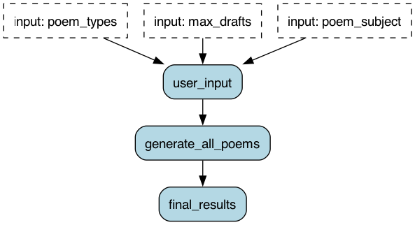
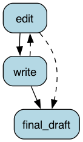

# Recursive Applications

Burr supports running applications inside applications. Currently this is done through sharing links in tracking,
but we will be adding more features to make this more ergonomic.

## Example Structure

This example runs a simple applications. We:
1. Gather input from the user for a poem subject, a maximum number of drafts, and a list of poem types in parallel
2. Run a recursive application that generates a poem for each poem type
3. Display the generated poems back to the user

The overall application looks like this:



The `generate_all_poems` then runs `n` (one for each poem type) instances of the sub-application:



## Running the example

To run this, you'll need an OpenAI key set.
Then you can run:

```bash
export OPENAI_API_KEY=...
python application.py
```

This will generate three poems about state machines, one for each type of poem, then combine at the end.

To change the poem type, edit `application.py` and change the `poem_types` list in the mainline.

Run the example with `python application.py`. Then, ensure `burr` is running, and navigate to the
UI: [http://localhost:7241/project/demo:parallelism_poem_generation](http://localhost:7241/project/demo:parallelism_poem_generation).


FOr more information, read the documentation on [recursive applications](https://burr.dagworks.io/concepts/recursion).
```
