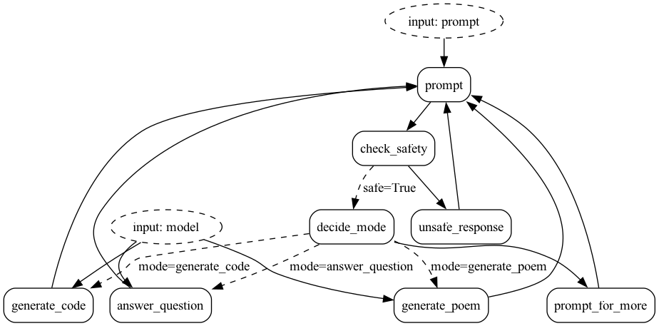

# Streaming in FastAPI

This example demonstrates how to stream data from Burr's streaming mode through FastAPI.

This is gone over in more detail in [our blog post](https://blog.dagworks.io/p/streaming-chatbot-with-burr-fastapi). This README will go over the main code + roles and how to run the example.

This uses Server Sent Events (SSE) to stream data from FastAPI to the frontend. This also uses Async Generators to ensure optimal performance.

## Example

The application we created will be a simple chatbot proxy. It has a few diffrent modes -- it can either decide a prompt is "unsafe" (in this case meaning that it has the word "unsafe" in it, but this would typically go to specific model),
or do one of the following:

1. Generate code
2. Answer a question
3. Generate a poem
4. Prompt for more

It will use an LLM to decide which to do. It streams back text using async streaming in Burr. Read more about how that is implemented [here](https://burr.dagworks.io/concepts/streaming-actions/).

Note that, even though not every response is streaming (E.G. unsafe response, which is hardcoded), they are modeled as streaming to make interaction with the app simpler.

The app looks like this:



## Running the example

You will need an API key from Open AI to run this.

You'll first have to have `burr[start]` installed. You can then view this demo in your app by running Burr:

```bash
burr
```

This will open a browser on [http://localhost:7241](http://localhost:7241)

Navigate to the [streaming example](http://localhost:7241/demos/streaming-chatbot).

## Streaming in Burr

Read more [here](https://burr.dagworks.io/concepts/streaming-actions/)
To use streaming in Burr, you write your actions as a generator. If you're using the function-based API (as we do in this example),
the function should yield a tuple, consisting of:
1. The result (intermediate or final)
2. The updated (`None` if intermediate, present if final)

(2) will always be the last yield, and indicate that the streaming action is complete. Take, for example, the
"unsafe" response, meaning that the LLM has determined that it cannot respond. This is a simple example -- just to illustrate streaming:

This sleeps to make a point (and make the demo more fun/give the appearance of the app "thinking") -- in reality you really would not want to do this.

```python
@streaming_action(reads=["prompt", "chat_history"], writes=["response"])
async def unsafe_response(state: State) -> Tuple[dict, State]:
    result = {
        "response": {
            "content": "I am afraid I can't respond to that...",
            "type": "text",
            "role": "assistant",
        }
    }
    for word in result["response"]["content"].split():
        await asyncio.sleep(0.1)
        yield {"delta": word + " "}, None
    yield result, state.update(**result).append(chat_history=result["response"])
```

This is an async generator that yields just the delta until it gets to the end. This can easily proxy from another service (openAI for example),
or do some other async operation.

When you call the action, you will get back a `AsyncStreamingResponseContainer` object. This is *also* an async generator!

```python
action, streaming_container = await app.astream_result(
    halt_after=TERMINAL_ACTIONS, inputs={"prompt": "Please generate a limerick about Alexander Hamilton and Aaron Burr"}
)

async for item in streaming_container:
    print(item['delta'], end="")
```

This will stream the results out.

## Connecting to FastAPI

To connect to FastAPI, we need to do the following:

1. Instantiate a Burr Application in FastAPI
2. Create a route that will stream the data to the frontend, which is *also* an async generator.
3. Bridge the two together

In [server.py](server.py), we have a helpful `_get_application` function that will get or create an application for us.
We can then call a chat_response function that looks like this:

```python
@router.post("/response/{project_id}/{app_id}", response_class=StreamingResponse)
async def chat_response(project_id: str, app_id: str, prompt: PromptInput) -> StreamingResponse:
    burr_app = _get_application(project_id, app_id)
    chat_history = burr_app.state.get("chat_history", [])
    action, streaming_container = await burr_app.astream_result(
        halt_after=chat_application.TERMINAL_ACTIONS, inputs=dict(prompt=prompt.prompt)
    )

    async def sse_generator():
        yield f"data: {json.dumps({'type': 'chat_history', 'value': chat_history})}\n\n"

        async for item in streaming_container:
            yield f"data: {json.dumps({'type': 'delta', 'value': item['delta']})} \n\n"

    return StreamingResponse(sse_generator())
```

Note this returns a [StreamingResponse](https://fastapi.tiangolo.com/advanced/custom-response/#streamingresponse)
and does some fancy stuff with the SSE API. Particularly:
1. It returns the initial state, so the UI can update to the latest (not strictly necessary, but nice to have for rendering)
2. It streams the deltas as they come in
3. It returns the data in the format: "data: ...\n\n" as this is standard for SSE

And it's as simple as that! You can now stream data from Burr to FastAPI.

## Streaming in Typescript/React

This part can get a little messy with state management/chat history, but here's the basics of it. There are multiple approaches
to managing SSE in React, but we will be using the very bare-bones `fetch` and `getReaders()` API.

The following code is the `submitPrompt` function that will send the prompt and modify the state. This gets called when the
user submits a prompt (E.G. on the `onClick` of a button).

It relies on the state variables:

- `currentPrompt`/`setCurrentPrompt` - the current prompt
- `chatHistory`/`setChatHistory` - the chat history

This also assumes the server is a post request with the prompt in the URL (putting it in the body is probably better...)

### Fetch the result (POST)

First we'll fetch the result with a post request to match the endpoint above. We will also get a reader object
to help us iterate through the inputs:

```typescript
const response = await fetch(
      `/api/v0/streaming_chatbot/response/${props.projectId}/${props.appId}`,
      {
        method: 'POST',
        headers: { 'Content-Type': 'application/json' },
        body: JSON.stringify({ prompt: currentPrompt })
      }
    );
const reader = response.body?.getReader();
```

Then we'll run through the reader object and parse the data, modifying the state as we go:

```typescript
if (reader) {
      const decoder = new TextDecoder('utf-8');
      // eslint-disable-next-line no-constant-condition
      while (true) {
        const result = await reader.read();
        if (result.done) {
          break;
        }
        const message = decoder.decode(result.value, { stream: true });
        message
          .split('data: ')
          .slice(1)
          .forEach((item) => {
            const event: Event = JSON.parse(item);
            if (event.type === 'chat_history') {
              const chatMessageEvent = event as ChatHistoryEvent;
              setDisplayedChatHistory(chatMessageEvent.value);
            }
            if (event.type === 'delta') {
              const chatMessageEvent = event as ChatMessageEvent;
              chatResponse += chatMessageEvent.value;
              setCurrentResponse(chatResponse);
            }
          });
      }
      setDisplayedChatHistory((chatHistory) => [
        ...chatHistory,
        {
          role: ChatItem.role.USER,
          content: currentPrompt,
          type: ChatItem.type.TEXT
        },
        {
          role: ChatItem.role.ASSISTANT,
          content: chatResponse,
          type: ChatItem.type.TEXT
        }
      ]);
      setCurrentPrompt('');
      setCurrentResponse('');
      setIsChatWaiting(false);
}
```
In the above we:
1. Check if the reader is present (it is likely worth adding more error-correcting here)
2. Break if the reader is done
3. Decode the message
4. Parse the message
    a. If it is a chat history event, update the chat history
    b. If it is a delta event, update the chat response
5. Update the chat history with the new prompt and response
6. Reset the variables so we don't render them twice

While the logic of updating state is bespoke to how we do it here, looping through the reader and parsing the data
is a common, highly generatizable operation.

Note there are multiple ways of doing this -- this was just the simplest.
