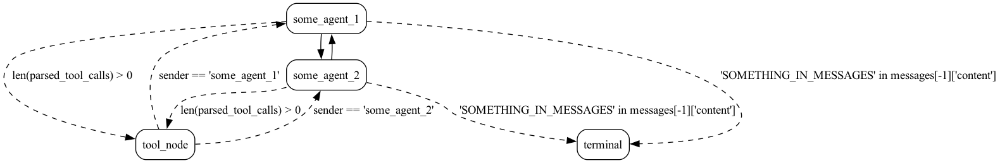
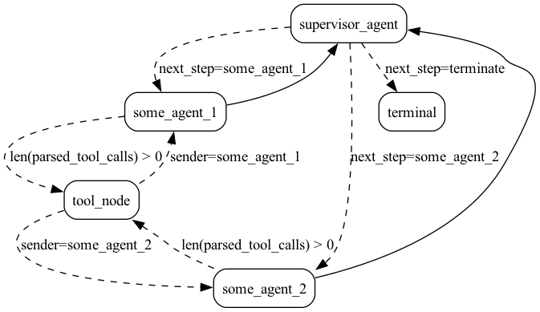
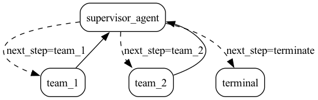

# Templates

Some bones of a Burr application to get you started.

## multi_modal_agent
Simple example of a multi-modal agent that can switch between different modalities.

)

## multi_agent_collaboration
Example of a multi-agent system where agents can collaborate to solve a task.

## agent_supervisor
Example of a multi-agent system where agents are supervised by a supervisor agent.

## hierarchical_agent_teams
Example of a multi-agent system where agents are organized in hierarchical teams.
Recursively each team mirrors the `agent_supervisor` example above.

Note: we're working on a better API to express this so you can also see the
entire hierarchy in the diagram.

