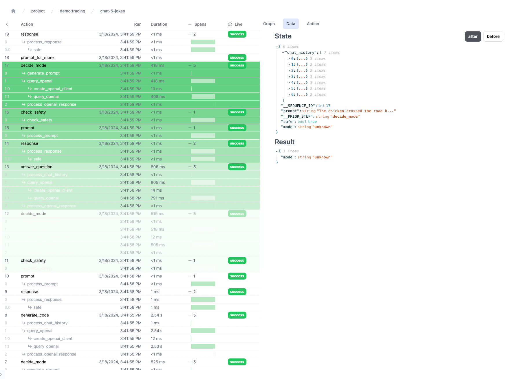

# Traces and spans

This demo covers the tracing/span capabilities in Burr.
For additional information, read over: [the documentation](https://burr.dagworks.io/concepts/additional-visibility/).
This does the same thing as the standard [multi-modal example](../multi-modal-chatbot), but leverages traces.

Note that you'll likely be integrating tracing into whatever framework (langchain/hamilton) you're using -- we're
still building out capabilities to do this more automatically.

These traces are used in the Burr UI. E.G. as follows:

The notebook also shows how things work. 
