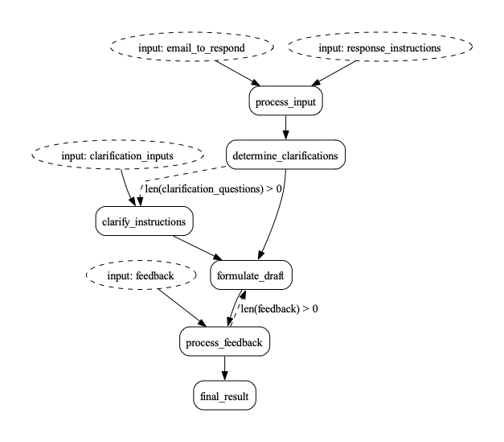

# Running Burr in a web server

Burr is meant to run interactive apps. This means running it as part of a web-service that
responds to requests, manages state, and documents its capabilities. The interactive nature of Burr
(moving in/out of programmatic control) means we want to think carefully about how to expose
our Burr applications to the web.

In this tutorial we will use the [email assistant example](../email-assistant) as a walk-through.
Our goal is to expose the email assistant in a web-server that a UI can easily be built on top of.
While we will not be building the UI here, we will link out to the final product for you to explore.

## Email Assistant

The email assistant is an example of a "human-in-the-loop" generative AI application. This means that
it requires human assistance at multiple points to build a better product.

### Running the example

If you want to get a sense for how this looks, open the burr UI:

```bash
pip install "burr[start]"
burr
```

Then navigate to the [email assistant](http://localhost:7241/demos/email-assistant),

You can create a new "application" and see it run through, with the telemetry on the right side.

### Conceptual Model
At a high-level, the email assistant does the following:

1. Accepts an email + instructions to respond
2. Comes up with a set of clarifying questions (if the LLM deems it required)
3. Using the answer to those questions, generates a draft
4. Accepts feedback to that draft and generates another one, repeating until the user is happy
5. Returns the final draft

Due to the stochastic, often complex nature of LLMs, this has been shown to be one of the most promising
applications -- a collaboration between humans and AI to quickly build high-quality responses.

### Modeling with Burr
This is a brief overview, for a more in-depth look at the email assistant, see the [email assistant example](../email-assistant).
To model our email assistant with burr, we can use the following diagram:



There are three points at which the user can interact:
1. `process_input`: This is where the user inputs the email and instructions
2. `clarify_instructions`: The LLM has created a set of clarification questions
3. `process_feedback`: The user has provided feedback on the draft

(3) repeats until the user is happy with the draft (in our implementation this occurs when the feedback they provide is empty)

Recall that we use the word "application" in Burr to refer to an instance of this process above
(with persisted state).

You can see the full application in [application.py](../email-assistant/application.py).

## Integrating in a web server

For this example we will use [FastApi](https://fastapi.tiangolo.com/) and [pydantic](https://docs.pydantic.dev/latest/),
but it should work with any other web-stack that uses python.

### Endpoints

We construct the following endpoints:

1. `POST /create`: This will create a new application and return the ID
2. `PUT /initialize_draft/{id}/`: This calls out to `process_input`, passing in the email and instructions
3. `PUT /clarify_instructions/{id}`: This will gives answers back to the LLM
4. `PUT /process_feedback/{id}`: This will give feedback back to the LLM
5. `GET /{id}/state`: This will return the current state of the application

The `GET` endpoint allows us to get the current state of the application -- this enables
the user to reload if they quit the browser/get distracted. Each of these endpoints will return the full state of the application,
which can be rendered on the frontend.  Furthermore, it will indicate the next API endpoint
we call, which allows the UI to render the appropriate form and

Using FastAPI + Pydantic, this becomes very simple to implement. First, let's add a utility to
get the `application` object. This will use a cached version or instantiate it:

```python
@functools.lru_cache(maxsize=128)
def _get_application(app_id: str) -> Application:
    app = email_assistant_application.application(app_id=app_id)
    return app
```

All this does is call to our function `application` in `email_assistant` that
recreates the application. We have not included the `create` function here,
but it calls out to the same API.

### Data Model

Let's then define a pydantic model to represent the state, and the app object in FastAPI:
```python

class EmailAssistantState(pydantic.BaseModel):
    app_id: str
    email_to_respond: Optional[str]
    response_instructions: Optional[str]
    questions: Optional[List[str]]
    answers: Optional[List[str]]
    drafts: List[str]
    feedback_history: List[str]
    final_draft: Optional[str]
    # This stores the next step, which tells the frontend which ones to call
    next_step: Literal["process_input", "clarify_instructions", "process_feedback", None]

    @staticmethod
    def from_app(app: Application):
        # implementation left out, call app.state and translate to pydantic model
        # we can use `app.get_next_action()` to get the next step and return it to the user
        ...
```

### Execution

Next, we can run through to the next step, starting from any point:

```python
def _run_through(project_id: str, app_id: Optional[str], inputs: Dict[str, Any]) -> EmailAssistantState:
    email_assistant_app = _get_application(project_id, app_id)
    email_assistant_app.run(  # Using this as a side-effect, we'll just get the state aft
        halt_before=["clarify_instructions", "process_feedback"],
        halt_after=["final_result"],
        inputs=inputs,
    )
    return EmailAssistantState.from_app(email_assistant_app)
```

We `halt_before` the steps that require user instructions, and `halt_after`
the final result. This allows us to get the state after each step.

Finally, we can define our endpoints. For instance:

```python
@router.post("/provide_feedback/{id}")
def provide_feedback(project_id: str, app_id: str, feedback: Feedback) -> EmailAssistantState:
    return _run_through(project_id, app_id, dict(feedback=feedback.feedback))
```

This represents a simple but powerful architecture. We can continue calling these endpoints
until we're at a "terminal" state, at which point we can always ask for the state.
If we decide to add more input steps, we can modify the state machine and add more input steps.
We are not required to hold state in the app (it is all delegated to Burr's persistence),
so we can easily load up from any given point, allowing the user to wait for seconds,
minutes, hours, or even days before continuing.

As the frontend simply renders based on the current state and the next step, it will always
be correct, and the user can always pick up where they left off. With Burr's telemetry capabilities
they can debug any state-related issues, ensuring a smooth user experience.

### Persistence

Note that we never called out to databases. It all just magically worked.. This is all because we decouple the persistence
layer from the web-call. The application will be persisted (to whatever database you want),
by burr's plugin capabilities -- read more [here](https://burr.dagworks.io/concepts/state-persistence/).
This greatly reduces the amount you have to think about when developing. As Burr persistence is
pluggable, you can write to your own database with whichever schema you prefer, customizing
the schema for your project or using a generic one (state is just a JSON object -- you can easily serialize/deseriealize it).

### Additional concerns

#### Scaling

But [is this webscale](https://www.youtube.com/watch?v=b2F-DItXtZs)? As anything, it depends on how you implement it.
Two factors determine the scalability of this system:

1. database layer -- can the database support the volume of inputs/outputs?
2. compute layer -- can the server run fast enough to keep up with the users?

For the database layer, it depends largely on the underlying database, as well as the
schema you use. That said, Burr makes it easier due to natural partitioning of the data
into `application_id` and `partition_key` (the latter could be the `user ID`), allowing common
operations (such as _give me all applications for X user_ and _give me the state of application Y_)
simple if you index your state table on the application ID and `partition_key`.

For the compute layer, you can simply scale horizontally. The only tricky aspect is ensuring state synchronization
and locking. As we cached the application object, we could potentially get into a position
in which the state is out of sync. To solve this, you can either:

1. Use a locking method (either in the database) to ensure that only one server is running a given application at any point
2. Use sticky sessions/sharding to ensure that a given user always hits the same server
3. Handle forking/resolution of state at the persistence layer with a custom implementation

Or possibly some combination of the above.

#### Async

While we implemented synchronous calls, you can easily make these async by using `async def` and `await` in the appropriate places,
and using the `arun` method in Burr. Read more about async capabilities in [applications](https://burr.dagworks.io/concepts/state-machine/),
and [actions](https://burr.dagworks.io/concepts/actions/).

#### Streaming

You can use streaming to send back the stream of the output at any given point. You do this by creating a
[streaming action](https://burr.dagworks.io/concepts/streaming-actions/). You can then integrate with the
streaming respose in FastAPI to send back the stream of the output. You can do this with any steps
(intermediate or final) in your application.

#### Authentication/Data access

While Burr does not operate at the data access layer, this can be easily handles at the  application layer.
Any authentication system will tell you the user ID, which you can look in your DB to determine access
to your partition key.

## Wrap-up

In this tutorial we showed how to integrate Burr into a web-server. We used FastAPI and Pydantic
to create a simple but powerful API that allows users to interact with the email assistant, leveraging
Burr's persistence capabilities to ensure that the user can always pick up where they left off.

At a high-level, the real value of representing your application as a state machine (as Burr does)
is that it all becomes easier to think about. You don't have to conceptually model state persistence,
dataflow, and the web infrastructure in one piece -- they can all be built separately.

In the future we will be automating this process, allowing you to generate a FastAPI app from the Burr application.

For now though, you can find the resources for the current implementation:
- [application.py](../email-assistant/application.py)
- [server.py](../email-assistant/server.py)
- [ui](../../telemetry/ui/src/examples/EmailAssistant.tsx) -- this uses [ReactQuery](https://tanstack.com/query/latest/docs/framework/react/overview) to call the API and [react](https://react.dev/) to render the state.
